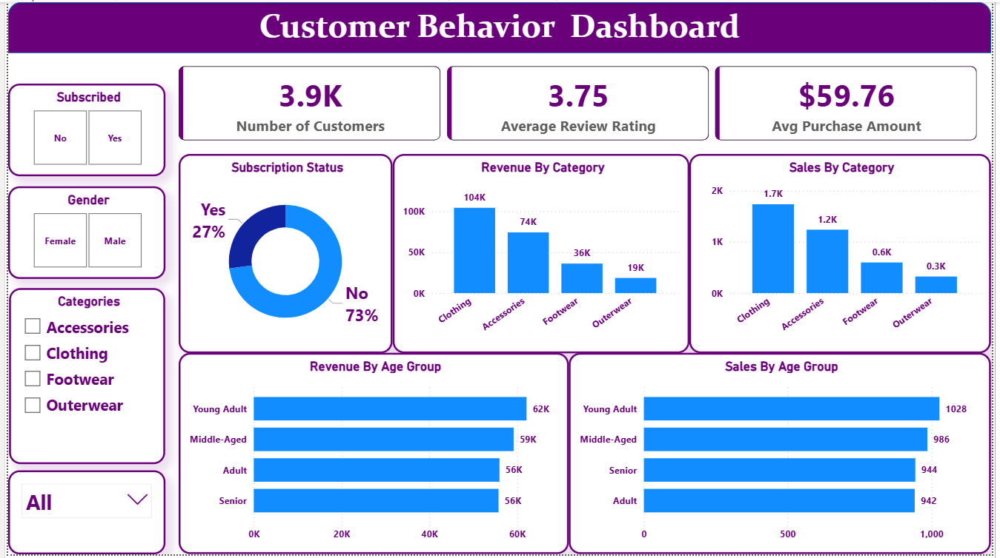

# 📊 Customer Sales & Revenue Analysis

**Data Analytics Project | Python, SQL (PostgreSQL), Power BI**

## 📌 Project Overview

This project analyzes customer purchasing behavior and revenue patterns to generate **actionable business insights** that support strategic decision-making. Using a complete data analytics workflow, the project covers **data loading, exploratory data analysis (EDA), data cleaning, SQL-based analysis, and interactive dashboard creation**.

The goal is to help the business **increase revenue, improve customer retention, and optimize marketing and logistics strategies** based on data-driven evidence.

---

## 🧰 Tools & Technologies

* **Python** (Pandas, NumPy, Matplotlib, Seaborn)
* **PostgreSQL** (SQL queries & aggregations)
* **Power BI** (Interactive dashboards & KPI tracking)
* **Jupyter Notebook**
* **Git/GitHub** (Version control & documentation)

---

## 📂 Project Workflow

### 1️⃣ Data Loading & Exploration (Python)

* Imported raw datasets using Pandas
* Reviewed schema, data types, and structure
* Identified missing values, outliers, and inconsistencies
* Performed univariate and bivariate analysis to understand trends

### 2️⃣ Data Cleaning & Preprocessing

* Handled missing and null values
* Corrected data types
* Removed duplicates and invalid records
* Standardized categorical variables
* Prepared cleaned dataset for database storage and analysis

### 3️⃣ SQL Analysis (PostgreSQL)

* Loaded cleaned data into PostgreSQL
* Wrote complex SQL queries using:

  * `JOINs`
  * `GROUP BY`
  * `CASE WHEN`
  * Subqueries and aggregations
* Analyzed:

  * Revenue by gender, age group, and subscription status
  * Shipping method performance
  * Customer type behavior (new vs repeat)
  * Subscription impact on revenue

### 4️⃣ Data Visualization (Power BI)

* Built an interactive dashboard with:

  * Revenue KPIs
  * Customer segmentation
  * Shipping method performance
  * Subscription vs non-subscription trends
* Enabled dynamic filtering for stakeholders
* Designed visuals for executive-level insights

---

## 📈 Key Business Insights & Recommendations

### 🔹 1. Gender-Based Revenue

**Insight:**
Male customers generate higher revenue compared to female customers.

**Recommendation:**

* Introduce targeted promotions and marketing campaigns aimed at attracting more female customers
* Personalize product offerings and messaging for female segments

---

### 🔹 2. Shipping Preferences

**Insight:**
Customers use **Express Shipping** more frequently than Standard Shipping.

**Recommendation:**

* Invest more in faster shipping methods
* Promote Express Shipping as a premium customer experience
* Optimize logistics partnerships to improve delivery speed

---

### 🔹 3. Subscription Performance

**Insight:**
Non-subscribed customers generate more revenue than subscribed customers.

**Recommendation:**

* Improve subscription value proposition
* Offer incentives such as **10% discounts for subscribers**
* Highlight exclusive benefits like early access or free express shipping

---

### 🔹 4. New Customer Acquisition

**Insight:**
The number of new customers is relatively low.

**Recommendation:**

* Increase advertising and brand awareness campaigns
* Invest in digital marketing and referral programs
* Partner with influencers or platforms to expand reach

---

### 🔹 5. Repeat Customers & Subscriptions

**Insight:**
Most repeat customers are **not subscribers**.

**Recommendation:**

* Offer loyalty-based subscription incentives
* Provide exclusive rewards for repeat customers who subscribe
* Introduce tiered membership benefits

---

### 🔹 6. Age Group Revenue Contribution

**Insight:**
Young adults contribute the majority of revenue among all age groups.

**Recommendation:**

* Continue targeting young adults with tailored campaigns
* Develop products and messaging that appeal to senior customers
* Offer age-specific promotions or simplified user experiences for older demographics

---

## 📊 Dashboard Preview

## 📊 Power BI Dashboard

---

## 🎯 Business Impact

This project enables stakeholders to:

* Identify high-value customer segments
* Improve customer acquisition and retention
* Optimize shipping and logistics strategies
* Increase subscription adoption
* Make informed, data-driven decisions

---

## 🚀 Future Enhancements

* Predictive modeling for customer churn
* Customer lifetime value (CLV) analysis
* A/B testing marketing strategies
* Automated data pipelines

---

## 👤 Author

**Jibran Malik**
Data Analyst
📧 Email: jibranmalik126@gmail.com
🔗 LinkedIn: https://www.linkedin.com/in/jibran-malik-99a90b176/
